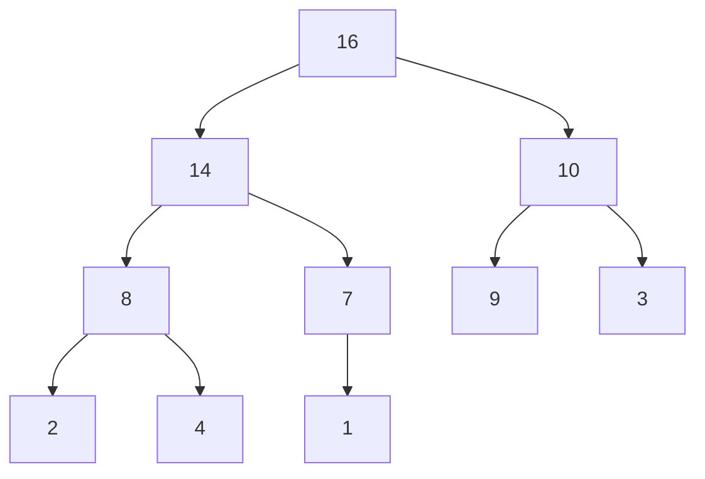
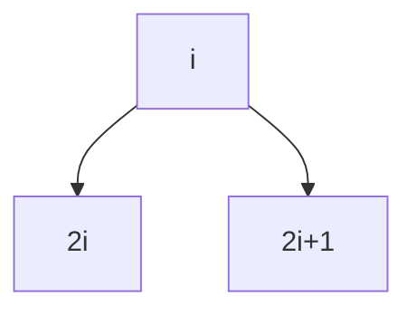

### Heap 이란?

1. complete binary tree 이면서
2. heap property를 만족해야 함

#### complete binary tree(완전이진트리)가 뭔데?



다음과 같이 마지막 레벨을 제외하면 완전히 꽉 차있고, 마지막 레벨에는 가장 오른쪽부터 연속된 몇 개의 노드가 비어있을 수 있는 형태.

이와 반대로 full binary tree(포화이진트리)는 모든 레벨에 노드들이 꽉 차있는 형태

binary tree(이진 트리)는 최대 둘의 자식 노드를 가질 수 있는 트리 형태를 말함.

#### 그렇다면 heap property는 무엇인가?

max heap이거나, min heap이거나를 만족해야 한다.

- max heap property: 부모가 자식보다 크거나 같다.
- min heap property: 부모가 자식보다 작거나 같다.

#### Heap의 표현은 어떻게 할까?

- 일차원 배열로 표현 가능 (A[1...n])
- 루트 노드 A[1]
- A[i]의 부모 = A[i/2]
- A[i]의 왼쪽 자식 = A[2i]
- A[i]의 오른쪽 자식 = A[2i + 1]



즉 위의 최대힙 도식은 ```[16,14,10,8,7,9,3,2,4,1]``` 로 나타낼 수 있다.

#### MAX-HEAPIFY

전체를 힙으로 만드는 과정.

전체의 모양은 complete binary tree여야 함.

유일하게 루트만이 heap property를 만족하지 않고, 왼쪽 subtree와 오른쪽 subtree가 모두 그 자체로 heap 인 경우에 해당함.

이때, 가장 간단한 방법은 root node의 두 자식들 중 더 큰 쪽이 자신보다 크면, 서로 재귀적으로 바꾸어주는 것이다.

의사 코드로 나타내면 다음과 같다.

```
// 노드 i를 루트로하는 서브트리를 heapify 한다.

MAX-HEAPIFY(A, i) {
  if there is no child of A[i]
    return;
  k = index of the biggest child of i;

  if (A[i] < A[k]) {
    exchange A[i] and A[k]
    MAX-HEAPIFY(A, k)
  }
}

MAX-HEAPIFY(1) // 초기 호출
```

#### 시간복잡도는 어떨까?

시간 복잡도는 높이에 의해 결정되며, 최악의 경우 시간 복잡도는 O(h)이다.

한편 heap은 일반적인 이진트리가 아닌 complete binary tree이며, 따라서 노드의 개수가 N일 때, 시간 복잡도는 O(logN)이 된다

### 그렇다면 Heap 정렬은 어떻게?

1. 정렬할 배열을 Heap으로 만들기

leap 부터 거슬러 올라가면서 어떠한 노드의 subtree가 heap을 만족한다면, 부모 노드를 기점으로 heapify를 한다.

주어진 배열의 마지막 노드 인덱스가 N일 때, 해당 노드의 부모 노드부터 시작하므로 heapify를 시작하는 첫 노드 인덱스는 N/2 이다.

```
heap-size[A] = A.length

for i = (A.length / 2) to 1 
  do MAX-HEAPIFY(A, i)
```

위의 코드의 시간복잡도는 O(NlogN)이 아니다. 서브 힙의 노드개수가 항상 N이지는 않을 것이기 때문이다. 오히려 힙을 만드는 데 필요한 시간복잡도는 O(N)에 가까이 된다.

2. 힙에서 최대값인 루트를 가장 마지막 값과 바꾼다.

3. 가장 큰 값이 마지막에 위치했으므로 제자리를 찾은 것이다. 힙의 크기가 1 줄어든 것으로 본다.

4. 이때 새로 root가 된 노드는 heap property를 만족하지 않을 수 있으므로, 다시 루트 노드에 대해 max heapify를 진행한다.

5. 2 ~ 4번을 반복한다.

의사 코드는 다음과 같다.

```
HEAPSORT(A)
  Build MAX-HEAP(A) // O(N)
  for i  = heap_size downto 2 do // O(N)
    exchange A[1] and A[i]
    heap_size = heap_size - 1;
    MAX-HEAPIFY(A, 1) // O(logN)
```

따라서 최종 시간복잡도는 O(NlogN) 이 된다.

출처: [권오흠 교수님 알고리즘 강좌](https://www.inflearn.com/course/%EC%95%8C%EA%B3%A0%EB%A6%AC%EC%A6%98-%EA%B0%95%EC%A2%8C/dashboard)