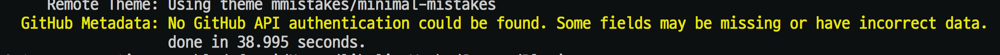
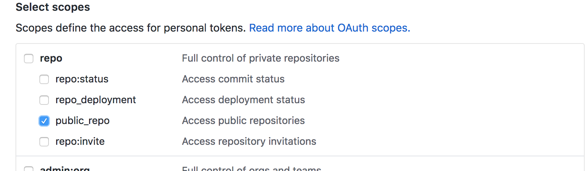
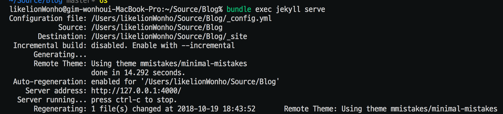

### 오류 내용
```bundle exec jekyll serve``` 명령어로 로컬에서 서버 띄울때 다음과 같은 오류 발생


### 해결
Github > Setting > Developer Setting > Personal access tokens 에서 토큰을 발급 받는다.<br>
Generate new token을 선택하고 repo > public_repo (혹 private이라면 그에 맞게) 체크박스 체크 후 토큰 생성



이후 토큰 키가 뜨는데, 이 페이지에서밖에 볼 수 없으니 어딘가에 메모하도록 하자.<br>
이 토큰 키를 home디렉토리의 .bash_profile에 변수로 등록한다.

```vim
vim ~/.bash_profile
export JEKYLL_GITHUB_TOKEN="your token" 추가
:wq
source ~/.bash_profile
```

이 절차를 거쳐 환경변수 등록 후 bash profile을 재실행한다
이후 bundle exec jekyll serve 로 로컬 서버를 돌리면 정상적으로 실행되는것을 볼 수 있다.

