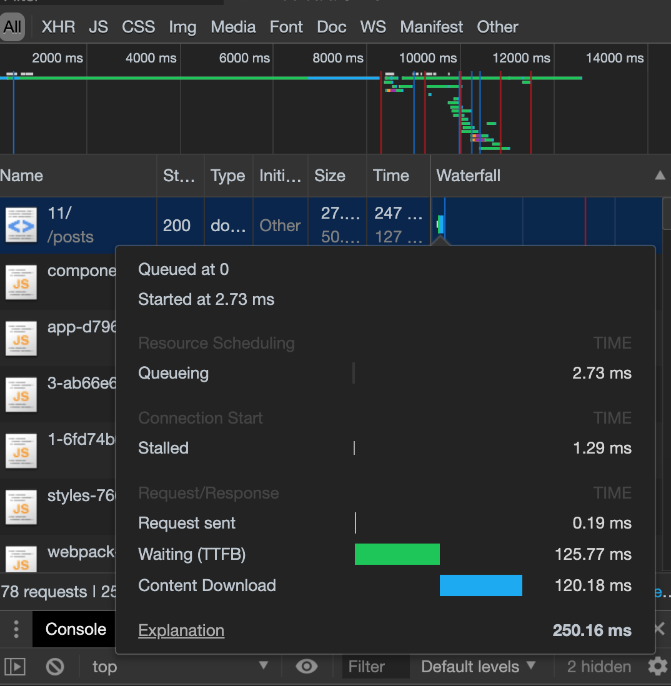
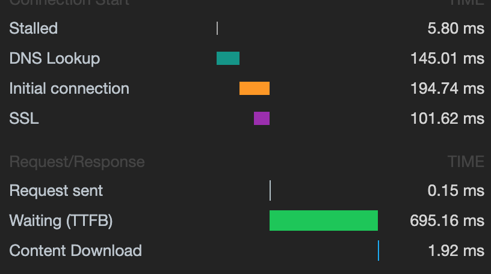

이 글은 2019.04.11 네이버 Techcon에서 손찬욱님의 세미나를 듣고 개인적으로 정리한 글입니다.

### 개요

웹앱의 성능에 관계 있는 요소들은 여러 가지가 있다. 이 글에서는 웹앱의 성능 하락 원인을 분석하고 어떻게 해결해야 하는가에 대해 알아본다.

일반적으로 서버 성능 분석가들의 관심사는, 서버가 얼마나 많은 트래픽을 감당하고 처리할 수 있는가에 있다. 반면 클라이언트 사이드에서는 사용자의 입력에 대해 얼마나 빠르게 반응하는가에 초점을 맞춘다. 입력은 주소창에 도메인을 입력하는것에서 부터, 애니메이션을 트리거하는 버튼을 클릭하기까지 다양하게 발생할 수 있다.

즉 초기 Loding과 Interaction에 대한 적절한 반응성을 고려해야 한다.

### 로딩 속도의 개선

#### 로딩 성능 개선 작업을 어떻게 할 것인가?

가장 중요한 것은 문제의 본질을 먼저 파악하는 것이다. 현재 프로덕트에서 사용자에게 가장 가치를 가져다 주는 부분이 무엇인가? 이를 파악하고 성능 개선의 대상을 먼저 정의해야 한다. 페이지, 이미지, 컴포넌트 등, 무엇이든 해당할 수 있다. 이를 정의한 뒤, 이 부분의 성능을 높이기 위해 노력해야 한다.

#### 개선 프로세스
1. 측정: 어디가 얼마나 느린지 측정한다.
2. 분석: 왜 느린지에 대한 원인을 파악한다.
3. 최적화: 1차적으로 성능을 개선한다.
4. (재) 측정
5. 위의 프로세스 반복

언제까지 반복해야 할까?

목표에 도달할 때 까지 반복해야 한다.

#### 목표는 어떻게 잡을까?

기준은 정하기 나름이지만, 일반적으로 사용자가 기다릴 수 있는 최대의 로딩 속도를 3초 정도로 잡는다. 참고로 구글에서는 [RAIL 모델](https://developers.google.com/web/fundamentals/performance/rail?hl=ko) 이라는 사용자 중심 성능 모델을 기반으로 하는데, 1초 이내에 컨텐츠를 로딩하기를 권장한다. 또 단순 로딩 속도를 측정하는 것이 아니라, 사용자가 반드시 보아야 할 HERO 컨텐츠를 노출하는 데 까지 걸리는 시간을 기준으로 한다.

#### 로딩 속도 개선 작업 시작하기

- 브라우저가 어떻게 동작 하는지 먼저 이해해야 한다.
- 그런 다음 로딩 속도를 측정, 분석한다.
- 핵심은 **Waterfall 차트이다.**
- 이 Waterfall 차트를 개선하는 것이 성능을 개선하는 첫걸음이다.

#### Waterfall 차트란?

- chrome devtool에서 network 탭을 보면 자원을 내려 받는 쪽에 waterfall 바 차트가 있다.
- 폭포수처럼 자원을 순차적으로 내려받는다는 의미의 waterfall 이다.
- 이 waterfall 차트의 timeline **높이를 줄이고, 너비를 줄이고, 간격을 당기는 것이 핵심.**

 

#### 높이 줄이기
높이를 줄이는 것은 리퀘스트의 수를 줄이는 것을 의미한다. 불필요한 request를 줄이는 것이 성능을 향상하는 첫걸음이다.

- js, css에 대해 번들 파일을 만든다. 사실 이건 대부분의 모던 웹앱에서 webpack, parcel 같은 모듈 번들러에 의해 수행된다.
- 캐싱되지 않아도 될 이미지(주로 작은 이미지)를 HTML 요청에 포함시켜서 data-uri 로 표현한다.
- 실수로 요청된 자원들을 코드상에서 제거한다.
- 초기 로딩시 필요 없는 자원들 역시 제거한다. code spliting 을 통해 라우트 별로 번들 파일을 분리하고, 공통 모듈 파일을 만들어 캐싱한다.
- 뷰포트 바깥에 있는 이미지는 초기 로딩 속도를 위해 lazy loading을 해준다. 이미지의 사이즈는 보통 전체 용량의 50% 가량 차지한다.

#### 너비 줄이기
너비를 줄이는 것은 파일의 용량을 줄이는 것을 말한다. 여기에 해당되는 지표는 initial connection, waiting(TTFB), Content downloaded 이다. 아래 이미지에서 자세히 확인해 보자.

##### Inital Connection

연결을 설정하는 데 걸린 시간이다. tcp handshake 과정과 재시도, ssl 협상 등이 포함되는 시간이다. 이를 줄이려면 사실 http/2가 답이다. http 1.1은 동일한 도메인에 대해 커넥션의 제한이 있고, 하나의 커넥션 당 하나의 요청을 처리한다. 때문에 동시전송이 불가능하고 요청과 응답이 순차적이라 다수의 리소스에 대해서는 대기 시간이 길어져 병목이 발생할 수 있다. 한편 http/2에서는 하나의 커넥션을 맺으면 동시에 여러 개의 메시지를 stream으로 주고 받을 수 있기 때문에 대기 시간이 줄어들게 된다. 즉 이 시간의 단축은 프로토콜의 개선으로 해결해라.

##### TTFB(Time to Fisrt Byte)

첫 바이트를 받은 시간이다. 이 시간은 서버까지 왕복하는 데 걸린 지연 시간에 서버가 응답을 전달하기를 기다리는 데 보낸 시간을 더한 것이다. 즉 connection time을 개선하고도 이 시간의 단축이 이루어지지 않는다면 자원을 내려주는 서버의 튜닝이 필요하다.

##### Content Downloaded

이 지표가 높다면 네트워크 속도가 낮거나, 컨텐츠의 크기가 크거나 둘 중 하나일 것이다. 컨텐츠의 크기를 줄이기 위해 코드상에서 minify, gzip, tree shake 등을 고려해 볼 수 있다. 이는 http/2에서 제공하는 헤더 압축과는 다른 것으로, 헤더를 압축했다고 해서 자원의 압축을 수행하지 않는 것은 잘못된 것이다.

이 외에도 다양한 방법을 수행할 수 있다.

- 실제 이미지 크기를 줄여라. 실제 사용되는 이미지 사이즈만큼 이미지를 가공해라.
- 이미지 포멧(jpg, png, webP 등)에 따른 용량 차이를 고려하고, 이미지 메타데이터가 불필요할 경우 삭제해라.
- 이미지 브라우저 렌더링 비용을 고려해라.

#### 간격 당기기
간격을 당긴다는 것은 자원을 내려받는 사이사이의 gap을 줄이는 것을 의미한다. 

- 브라우저의 렌더링 과정에서 js의 dom, cssom 개입을 최소화해라. 즉 동기적으로 불러와지는 js가 dom rendering을 blocking 하지 않게 해야 한다.
- head 태그에는 css와 필수 js만 넣어라.
- body 태그 마지막에 js를 넣어라.
- dom 제어와 관련이 있는 스크립트는 defer attribute를 이용하라.
- Google Analytics 같이 의존성이 없는 스크립트는 async를 이용해라. 
- 자원에 대해 [리소스 우선순위](https://developers.google.com/web/fundamentals/performance/resource-prioritization?hl=ko)를 지정해라. 

#### 총체적으로 점검하기
- Chrome Devtool의 Audit 탭을 이용하면 lightHouse 를 이용해 성능 측정을 간편하게 할 수 있다.
- First Paint 는 Head 태그가 종료 후 Body 태그를 브라우저가 파싱해서 렌더링 시키기까지의 시간이다.
- First Meaningful Paint(FMP)는 구글의 로딩 지표이며, Hero 엘리먼트가 보이는 시점까지의 시간이다.
- TTI(Time to Interaction)는 사용자가 인터랙션 할 수 있기까지의 시간이다.

이 외에 lazy하게 처리해야 할 요소와 그렇지 않은 요소를 구분하는 과정도 필요하다.

로딩 성능을 개선했을 때, 앞서 말한 waterfall 차트의 높이, 너비, 간격을 줄임과 동시에, 이들의 균형감이 유지된다면 바람직한 개선으로 볼 수 있다. 각각의 Request가 비교적 균등한 크기가 되어야 어느 한 자원에서 병목이 발생할 확률이 적을 것이다.

### 인터랙션 속도 개선하기

지금까지 로딩 속도를 개선했다면, 사용자의 앱 내에서의 인터랙션이 이루어지는 속도도 개선해야 할 것이다.

브라우저는 Main Thread에 의해 Rendering Pipeline이 동작하고, 이 파이프라인이 일반적으로 16ms 내에 끝마쳐져야 한다. 브라우저의 초당 프레임 수(FPS) 를 최소 60FPS로 권장하는 것은, 대부분의 디스플레이의 주사율이 60hz 이상이기 때문이다. 즉 사용자가 자연스럽다고 느끼려면 1초(1000ms)에 60프레임 이상은 나와 줘야 하는 것이고, 16ms 내에 1프레임이 완성되어야 한다는 것을 의미한다.

그러면 어떻게 해야 할까? 

브라우저의 렌더링은 html parsing + css parsing => render tree 형성 => layout => paint => composite 의 일련의 과정을 거친다. 

이 과정이 여러번 반복되면 프레임에 악영향을 미칠 것이다. 하나의 레이어에서 이 플로우가 최대한 1번 이상 발생하지 않게 하는 것이 중요하다. 즉 브라우저의 reflow, repaint를 방지해야 하는 것이다.

이 외에 애니메이션 등의, 반드시 reflow나 repaint가 발생할 수밖에 없는 부분에서는 GPU의 도움을 받는 하드웨어 가속이 일어나게끔 할 수 있다. render tree의 한 부분에서 새로 스타일 계산이 이루어진다면, 해당 element와 맞물려 있는 다른 element에 까지 영향을 미쳐 전체적인 reflow가 발생할 수 있다.

웹 페이지는 여러 레이어가 composite된 결과물이고, 이 레이어는 render layer, graphics layer 등으로 나누어진다. 
레이어는 브라우저가 규칙에 따라 구성할 수도 있고, 인위적으로 구성할 수도 있다. 스타일 계산이 잦게 일어나는 element에 대해 레이어를 적절히 분리해 다른 레이어에 영향을 최소화할 수 있다. 하드웨어 가속에 관해서는 [d2의 다음 글](https://d2.naver.com/helloworld/2061385)이나 NTS UI 개발 블로그에 있는 [이 글](http://wit.nts-corp.com/2017/06/05/4571)을 참조할 수 있을 것 같다.

### 성능과 관련해 참조할 만한 글
[크롬 렌더링 성능 인자 이해하기](https://medium.com/@cwdoh/%ED%94%84%EB%A1%A0%ED%8A%B8%EC%97%94%EB%93%9C-%EA%B0%9C%EB%B0%9C%EC%9E%90%EB%A5%BC-%EC%9C%84%ED%95%9C-%ED%81%AC%EB%A1%AC-%EB%A0%8C%EB%8D%94%EB%A7%81-%EC%84%B1%EB%8A%A5-%EC%9D%B8%EC%9E%90-%EC%9D%B4%ED%95%B4%ED%95%98%EA%B8%B0-4c9e4d715638)

[100,000개의 아이템도 거뜬한 셀렉트박스 만들기](https://meetup.toast.com/posts/160)

