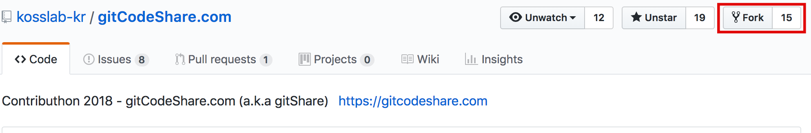
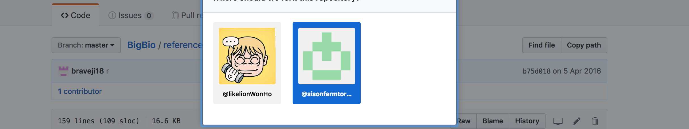
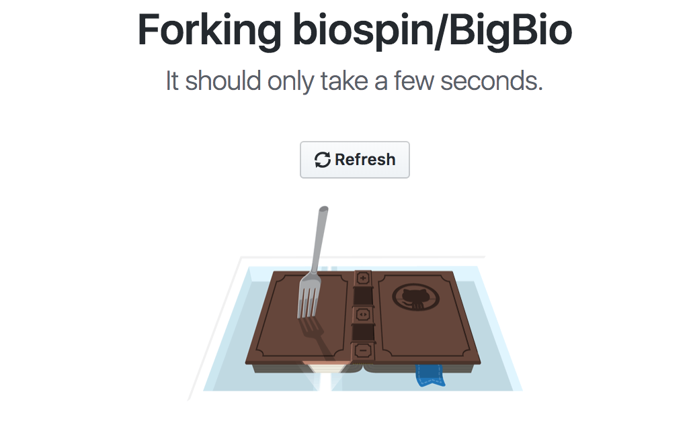
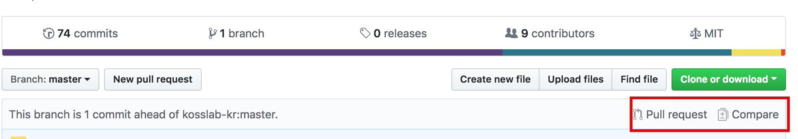
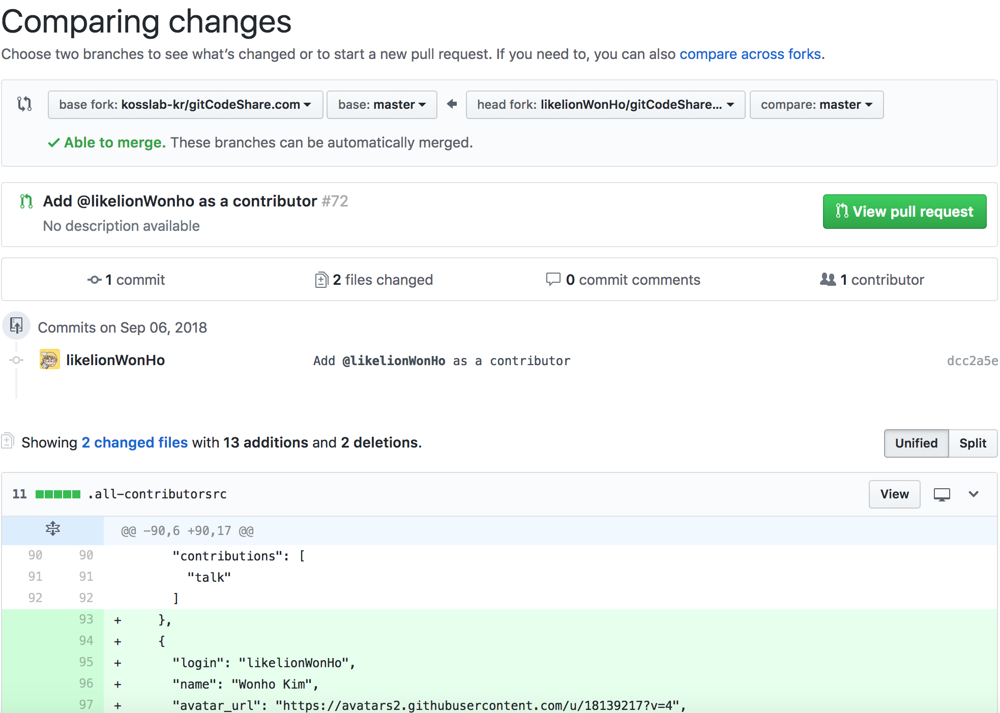

### 개요
소스코드로 협업을 할 떄 항상 원본 코드의 무결성이 유지되는 것은 필수적이다. 원본 코드라 함은 실제로 서비스에 반영되는 최신의 코드를 의미한다. 무결성을 유지하는 데는 다양한 방법이 있다. Git flow 를 주도적으로 사용한다면 주로 용도별로 브랜치를 나누어 적정 시기별로 Merge 를 할 것이고, Github flow 를 사용한다면, 마스터 브랜치의 무결성만 보장된다면 브랜치를 나누어 Merge 를 하던 Pull Request 를 하던 관계가 없다. (Github 은 Pull Request 를 권장한다.) 이번 포스팅에서는 후자를 주로 살펴볼 것이다.

### 오픈소스 기여의 시작, Fork

주로 Github 기반의 오픈소스에 기여할 때는 무결성이 너무나도 중요하기 때문에 일단 자신의 레포지토리에 포크를 한 뒤, 커밋을 하고, 커밋된 내용을 가다듬은 다음 풀 리퀘스트를 날리는 방식이 일반적이다.



예시로 필자가 지금 참여하고 있는 프로젝트인 GitShare 프로젝트의 레포지토리를 참조하였다. 깃허브의 레포지토리 상단 우측에 보면 Fork 버튼이 있는데, 이걸 클릭하면 자신의 계정과 (혹시 소속되어 있는 Organization 이 있다면) 자신의 그룹이 뜬다. 자신의 계정으로 Fork 하도록 하자



내 계정의 이미지를 누르게 되면 아래와 같이 Forking 로딩창이 뜬다.



Fork 하면 내 계정으로 레포지토리가 똑같이 하나 생성된 것을 볼 수 있을 것이다. 여기서부터는 일반적으로 github 에 올리는 방식과 같다. 일단 내 로컬로 clone 하도록 하자.

```javascript
git clone "<레포지토리 주소>"
```

그리고 나서 origin 을 확인해보면 내 레포지토리의 주소를 가리키고 있을 것이다. 하지만 우리는 하나 더 추가적으로 등록 해주어야 한다. 내 레포지토리와 관계 없이 원본 코드는 항상 업데이트되고 있을 것이고, 그것을 반영하기 위해서는 원본 저장소의 변경이 있을 때마다 그곳으로부터 소스를 pull 해와야 한다. 따라서 우리는 원격 저장소를 하나 더 등록하겠다. 일반적으로 upstream 이라는 네이밍을 사용하는 듯 하나 이름은 자유다.

```javascript
git remote set-url upstream "<원본 레포지토리 주소>"
```

자 이제 초기작업은 끝났다. 이제 남은 것은 소스를 변경하고, commit 한 뒤 풀 리퀘스트를 날리는 것이다.



커밋 후 origin 에 push 를 하면 이런 알림이 보일 것이다. 여기서 compare 는 원본 코드와 변경된 코드를 비교해 주겠다는 것이다. 터미널로 할수도 있으나 깃헙에서는 이렇게 간편한 gui 를 제공한다.



Compare 를 하게 되면 위와 같은 그림이 뜬다. 변경된 diff 를 비교해 머지에 이상이 없으면 정상적으로 able to merge 가 뜰 것이고, 그대로 머지하면 conflict 가 날 것 같은 코드에는 disable 이 뜬다. 만약 이상이 있으면 겹치는 코드를 정상적으로 변경해 준 뒤, pull request 버튼을 클릭하면 된다. 소스 기여자들이 요청된 pull request 가 합당하다고 판단된다면 pull request 를 받아주고, 아니라면 reject 할 것이다.

마지막으로, 풀 리퀘스트는 보는 사람으로 하여금 파악하기 쉽도록 깔끔하게 만들어야 한다. 여러 개의 관심사를 동일한 풀 리퀘스트에 놓는 것은 지양해야 하며, 하나의 이슈에 관한 커밋 덩어리만을 rebase 등을 활용해 이력 정리하여 올리는 것이 권장된다.